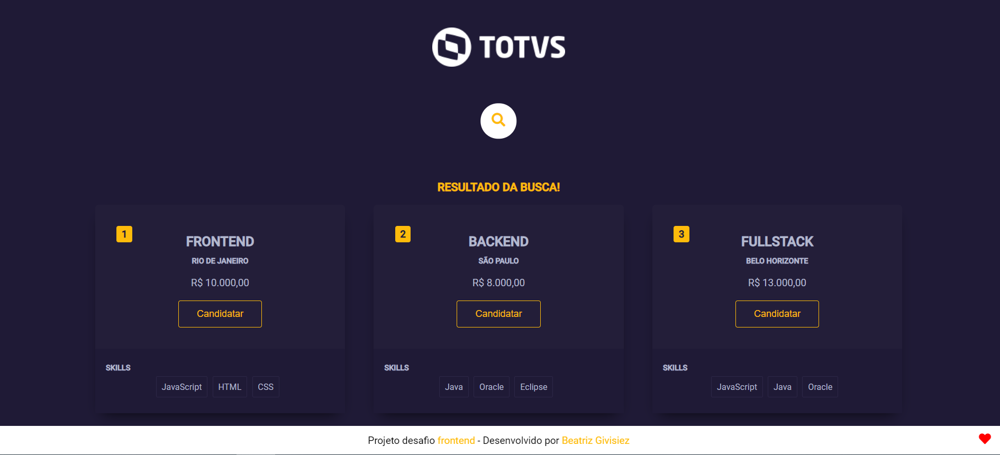
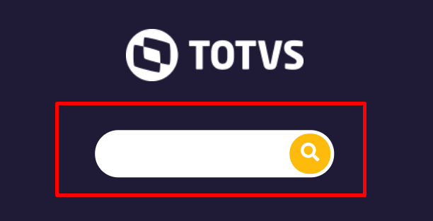
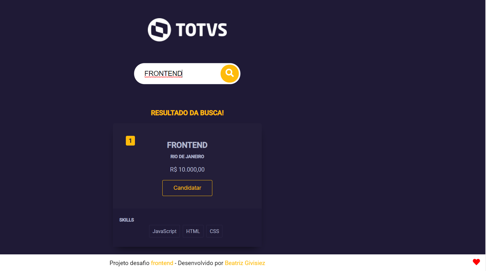

# Desafio Frontend Totvs 2021
Este projeto foi gerado com [Angular CLI](https://github.com/angular/angular-cli) version 8.2.0.  
(Utilizei o notebook da empresa o qual a intalação do Angular de forma -g "global").   
**Desenvolvido por Beatriz Givisiez**

### Projeto
Desenvolvi um projeto de sistema de busca vagas, contendo alguns cards contendo campos (id, nome, cidade, salario e requerimento). Um campo input search para pesquisar por **nome**. Fiz um layout moderno e abusei das cores. Também utilizei logo e favicon da empresa! \õ

### Imagens

